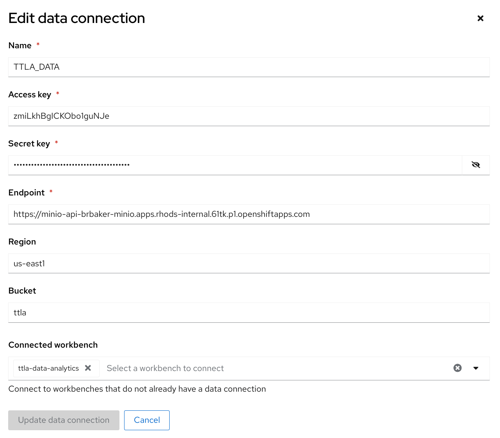
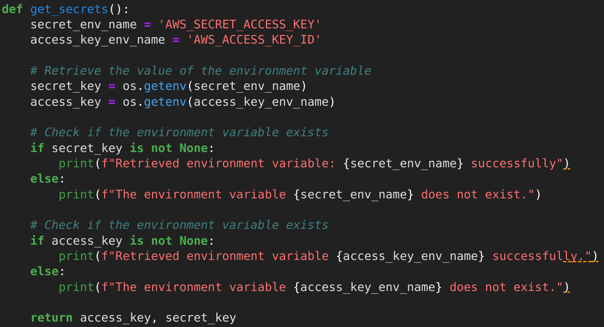
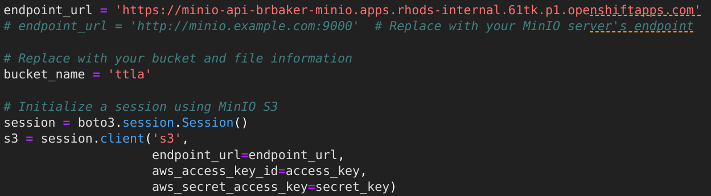
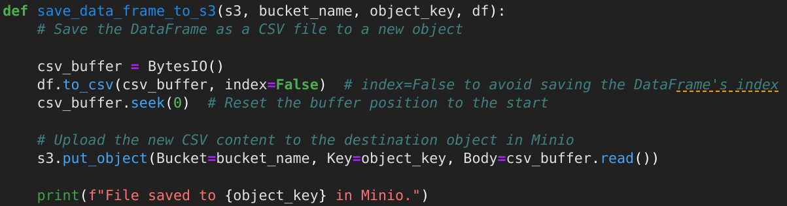

# Deploying and Accessing Minio From Applications

## Deploying Minio

There are two deployment configs in the ``yaml`` directory. 
* ``aws-minio-dep.yaml`` will deploy MinIO to OpenShift in AWS.
* ``local-minio-dep.yaml`` will deploy MinIO to OpenShift Local.

### Steps
1. Create a new project: ``oc new-project minio``
2. Deploy MinIO: ``oc apply -f yaml/aws-minio-dep.yaml``

## Using Minio

### Configuring a Data Connection

To use MinIO from your RHODS projects you must configure a data connection. The following diagram illustrates the configuraiton. Note that the url is the API endpoint for MinIO from the OpenSHift routes. This could also be the service endpoint and port if you want.

### Accessing MinIO From Your Application

It is important to make sure you do not include secrets in your code. The following code snippet shows how to get the RHODS Project's S3 secrets:

The following code snippet shows how to connect to the S3 storage:

The following code snippet shoes how to retrieve a file from the S3 storage:

The following code snippet shoes how to upload a file to the S3 storage.

